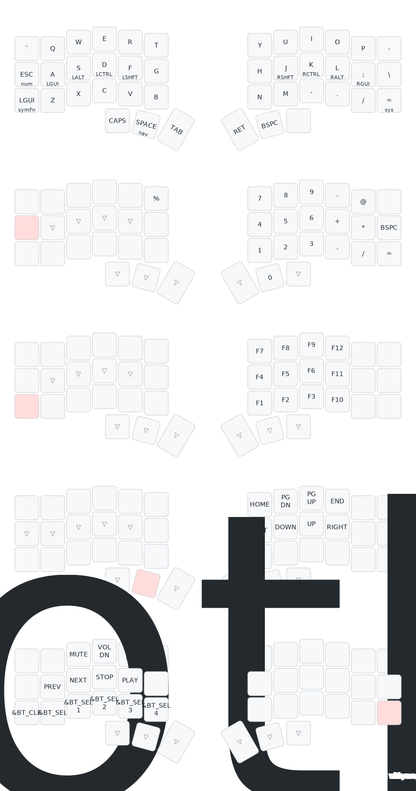

# ZMK configuration for corne wireless keyboard

[ZMK Firmware](https://zmk.dev) for the [Corne 42 keys wireless keyboard from typeractive.xyz](https://typeractive.xyz/products/corne-partially-assembled-pcb)

## Configuration

- [Keymaps](https://zmk.dev/docs/keymaps)
- [Configuration](https://zmk.dev/docs/config)

## Keymap

rendered with [@caksoylar's amazing keymap visualizer](https://keymap-drawer.streamlit.app)
